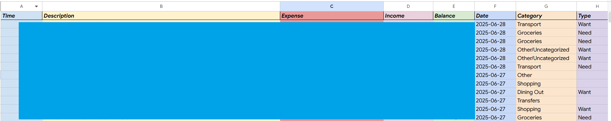
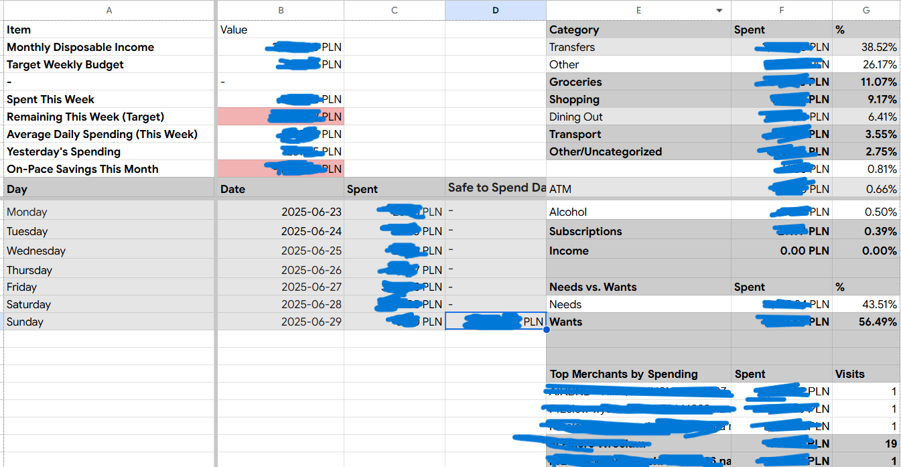
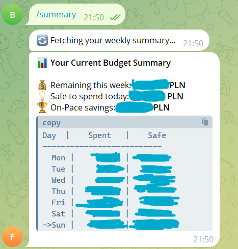
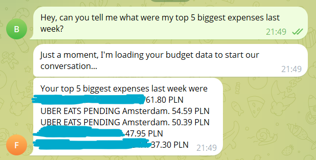

# 💰 Personal Finance Tracker & Telegram Bot 📊

## Project Overview

This project is a robust, automated personal finance management system. It seamlessly integrates various **Google services (Gmail, Sheets, Gemini AI)** with an interactive **Telegram bot** to automate expense tracking, provide insightful budget analytics, and offer personalized financial guidance. It's designed to minimize manual effort, allowing users to gain clarity and focus on their financial goals.

---

## Key Features

### Automated Data Ingestion
* **Gmail Integration**: Automatically fetches and processes transaction emails from a specified sender (e.g., mBank).
* **Intelligent HTML Parsing**: Extracts detailed transaction information from email attachments.
* **Smart Categorization**: Automatically categorizes transactions based on user-defined keywords. It learns and suggests new keywords, simplifying the ongoing categorization process.

### Dynamic Google Sheets Dashboard
* **Comprehensive Financial Metrics**: Calculates and presents real-time budget metrics, including:
    * Monthly Disposable Income
    * Weekly Spending vs. Target
    * Daily "Safe-to-Spend" Recommendations
    * On-Pace Savings/Overspending
* **Visual Spending Breakdowns**: Dynamically displays spending summaries by category and a "Needs vs. Wants" breakdown.
* **Top Merchants Analysis**: Identifies and highlights your top spending areas.
* **Automated Formatting**: Applies advanced GSheets formatting, including conditional formatting for visual budget alerts, precise column sizing, and frozen panes for superior readability.



*Parsed transactions list.*


*Detailed view of spending by category and the Needs vs. Wants analysis.*

### AI-Powered Financial Insights
* **Monthly Summary Archiving**: Automatically generates and stores a detailed summary of the previous month's financial performance.
* **Spending Anomaly Detection**: Proactively identifies unusual spending spikes in specific categories by comparing against historical averages, sending immediate alerts.
* **AI Weekly Digests**: Leverages **Google Gemini AI** to generate personalized, narrative summaries of your past week's spending, offering actionable insights and forward-looking advice.

### Interactive Telegram Bot Interface
* **On-Demand Budget Updates**:
    * `/summary`: Get an instant, mobile-friendly overview of your current budget, weekly spending, and daily "safe-to-spend" amount.

    

    * `/top5`: See your top 5 merchants by spending for the current month.
* **Guided Categorization**:
    * `/categorize`: Start an interactive conversation to quickly assign categories and types (Need/Want) to newly identified transaction keywords using intuitive inline buttons.
* **AI Financial Assistant**:
    * `/newchat`: Resets the AI conversation memory for fresh queries.
    * **Natural Language Querying**: Ask questions directly about your spending, budget, or financial habits (e.g., "How much did I spend on groceries last week?", "What's my biggest want expense this month?") and receive concise, data-driven answers.
    
    

---

## 🛠️ Technology Stack

* **Language**: Python 3.8+
* **Cloud Platforms**: Google Cloud Platform (Gmail API, Google Sheets API, Google Gemini API)
* **Key Libraries**:
    * `pandas`: For robust data manipulation and analysis.
    * `gspread`, `gspread_formatting`: Python clients for seamless Google Sheets interaction.
    * `google-api-python-client`, `google-auth-oauthlib`: Google API client libraries for secure authentication.
    * `beautifulsoup4`: Efficient HTML parsing for email data.
    * `python-telegram-bot`: Powerful framework for Telegram bot development.
    * `google-generativeai`: Direct integration with Google's Gemini AI.
    * `loguru`: Enhanced, easy-to-use logging for clear insights into script operations.

---

## 🚀 Getting Started

Follow these steps to set up and run the Personal Finance Tracker locally.

### Prerequisites

* Python 3.11+ installed.
* A Google Account with access to Google Cloud Platform.
* A Telegram account to create a bot.

### 1. Google Cloud Project Setup

1.  **Create/Select Project**: Go to [Google Cloud Console](https://console.cloud.google.com/) and create or select a project.
2.  **Enable APIs**: Navigate to **APIs & Services > Dashboard**. Enable:
    * `Gmail API`
    * `Google Sheets API`
3.  **OAuth Credentials**: Go to **APIs & Services > Credentials**.
    * Create an `OAuth client ID` of type `Desktop app`. Download the JSON file and rename it to `credentials.json`. Place this file in your project's root directory (`budget_tracker/`).
    * Configure your OAuth consent screen, ensuring the following **scopes** are added: `.../auth/gmail.readonly` and `.../auth/spreadsheets`.

### 2. Telegram Bot Setup

1.  **Create Bot**: Chat with `@BotFather` on Telegram. Use `/newbot` to create your bot and get its **HTTP API Token**.
2.  **Get Chat ID**: Start a chat with your new bot. Then, visit `https://api.telegram.org/bot<YOUR_BOT_TOKEN>/getUpdates` in your browser. Find `"chat":{"id":...}` in the JSON response – this is your `TELEGRAM_CHAT_ID`.

### 3. Google Sheets Setup

1.  **Create Spreadsheet**: In your Google Drive, create a new Google Sheet named **`Budget & Expenses Tracker`**.
2.  **Setup Worksheets (Tabs)**: Inside this spreadsheet, create the following tabs with these exact header rows (case-sensitive):
    * **`Sheet1`**: `Time | Description | Expense | Income | Balance | Date | Category | Type`
    * **`Budget`**: `A1: Item` | `B1: Value`. Manually enter your monthly income in cell `B2` (e.g., `5000`, usually I just input half of my income so the calculations are made on "disposable monthly income").
    * **`Categories`**: `Keyword | Category | Type` (e.g., `Biedronka | Groceries | Need`, `Netflix | Entertainment | Want`).
    * **`History`**: `Month | Total Spent | Bonus Savings | Needs % | Wants %`
3.  **Share Spreadsheet**: Share your `Budget & Expenses Tracker` sheet with **Editor** permissions to the email address found in your `credentials.json` file.

### 4. Google Gemini AI Setup

1.  **Get API Key**: Visit [Google AI Studio](https://aistudio.google.com/app/apikey) and generate your **API Key**.

### 5. Project Installation & Configuration

1.  **Clone the Repository**:
    ```bash
    git clone [https://github.com/jwojci/budget-tracker.git](https://github.com/jwojci/budget-tracker.git)
    cd budget-tracker
    ```
2.  **Create Virtual Environment**:
    ```bash
    python -m venv .venv
    .venv\Scripts\activate   # Windows
    source .venv/bin/activate # macOS/Linux
    ```
3.  **Install Dependencies**:
    ```bash
    pip install -r requirements.txt 
    ```
4.  **Configure Environment Variables**: Create a `.env` file in your `budget-1.0/` directory and add:
    ```env
    TELEGRAM_BOT_TOKEN="YOUR_TELEGRAM_BOT_TOKEN_HERE"
    TELEGRAM_CHAT_ID="YOUR_TELEGRAM_CHAT_ID_HERE"
    GEMINI_API_KEY="YOUR_GEMINI_API_KEY_HERE"
    ```
    *(Remember to keep `.env` out of version control via `.gitignore`)*

### 6. Initial Authentication & Sample Data Generation

The first time you run Google API scripts, a browser window will open for authentication.

1.  **Modify `main.py`**:
    Change the `if __name__ == "__main__":` block in `main.py` to:
    ```python
    # main.py
    # ...
    if __name__ == "__main__":
        asyncio.run(run_sample_data_generator()) # Uncomment this for initial setup
        # asyncio.run(main_scheduled_run())      # Comment this during setup
    ```
2.  **Run Setup**:
    ```bash
    python main.py
    ```
    Follow the browser prompts. A `token.json` file will be created. Verify sample data in your Google Sheet.
3.  **Revert `main.py`**: After setup, switch `main.py` back for daily operations:
    ```python
    # main.py
    # ...
    if __name__ == "__main__":
        # asyncio.run(run_sample_data_generator()) # Comment this after setup
        asyncio.run(main_scheduled_run())        # Uncomment this for daily runs
    ```

---

## Usage

### Daily Scheduled Workflow
Run this script periodically (e.g., daily via a cron job or task scheduler) to automate data ingestion, dashboard updates, and anomaly detection.

```bash
python main.py
````

### Interactive Telegram Bot

Start this script to keep your Telegram bot running and responsive to commands.

```bash
python bot_runner.py
```

## TODO: Dockerize the bot.

-----

## 🏛️ Project Architecture

This project is built with a layered, modular architecture based on the Single Responsibility Principle, ensuring maintainability, testability, and scalability.

  * **`main.py`**: Orchestrates the daily scheduled workflow.
  * **`bot_runner.py`**: Manages the Telegram bot application's lifecycle and handler registration.
  * **`config.py`**: Centralized constants and environment variables.
  * **`auth/`**: Handles Google OAuth authentication.
  * **`services/`**: Low-level wrappers for external API interactions (Google Sheets, Gmail, Telegram).
  * **`data_processing/`**: Manages data acquisition, cleaning, validation, and parsing.
  * **`analytics/`**: Contains core business logic for financial analysis, calculations, and reporting.
  * **`ai/`**: Manages all interactions with the Google Gemini AI.
  * **`bot/`**: Houses Telegram bot-specific logic and conversation handlers.

## 📈 Potential Improvements

  * **Expanded Bank Support**: Generalize the transaction parsing logic in `data_processing/transaction_parser.py` to support email formats from multiple banks or integrate directly with banking APIs (e.g., PSD2 APIs in Europe).
  * **Customizable Alerts**: Allow the user to define custom alert thresholds or types directly via the Telegram bot.
  * **Add Tests**: Add a test suite.
-----
