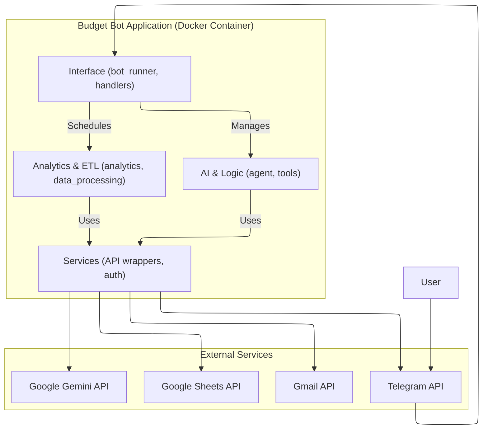
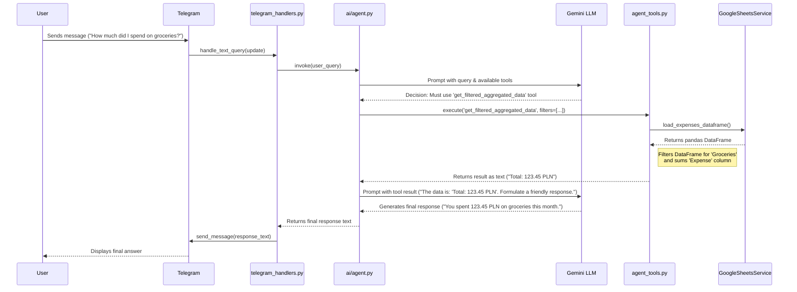
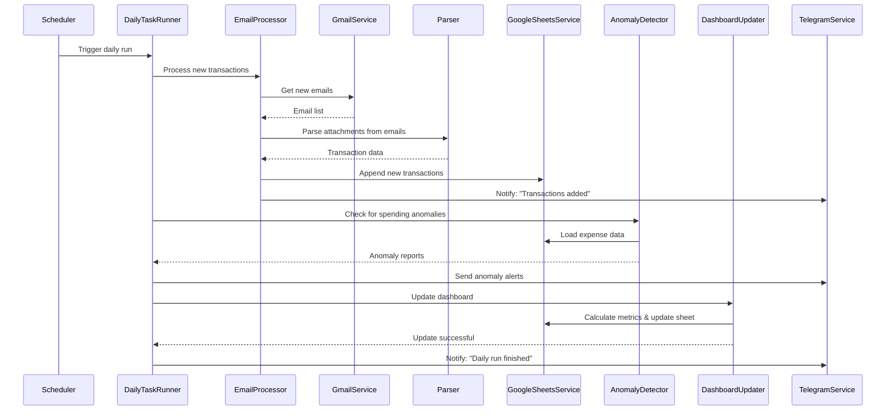

# Personal Budget Agent

## A Telegram bot using LangChain, Gemini and GCP to automate expense tracking and provide AI-driven insights.

 
 
 

### Why 
I built this because I wanted to start tracking my expenses but I wanted to do as little of manual work as possible. 
I wanted to have a system always running in the background that would automatically parse my daily banking transaction emails, update my budget and dashboard, allow me to ask questions about my expenses in natural language and provide intelligent insights. I decided to use spreadsheets as the main storage of data because it feels best for a personal project with the ui and easy inspection and editing of data.

## Demo 
Disclaimer: I used fake data for this demo.

![Demo]

## System Architecture 

### Main Architecture Overview

### Natural Language Querying
===

### Automated Daily ETL & Analytics Process

### Main Features 

### Running the project 

